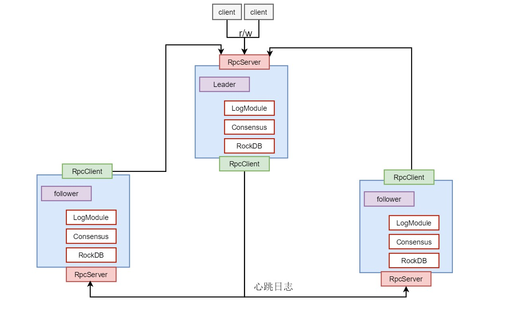

# raft-kv

[TOC]

## 介绍

一个基于raft算法实现的分布式K-V存储系统。在之前的项目中，个人使用raft算法对分布式网关的数据一致性模块进行构建，但是后面模块中参杂了部分的网关业务代码，因此，打算对分布式kv存储模块进行重构，实现一个独立的分布式K-V存储系统。

## 架构设计

## 使用说明

clone该库，跑多个副本，修改RaftBoostrap的地址配置即可，启动之后，查看控制台，有详细的日志信息。如果想使用其中的K-V存储功能，只需要用Request类对命令进行包装，并且new DefaultRpcClient().send()即可。

## 未来计划

- 分离心跳任务
- 实现eviction
- 实现动态节点调入